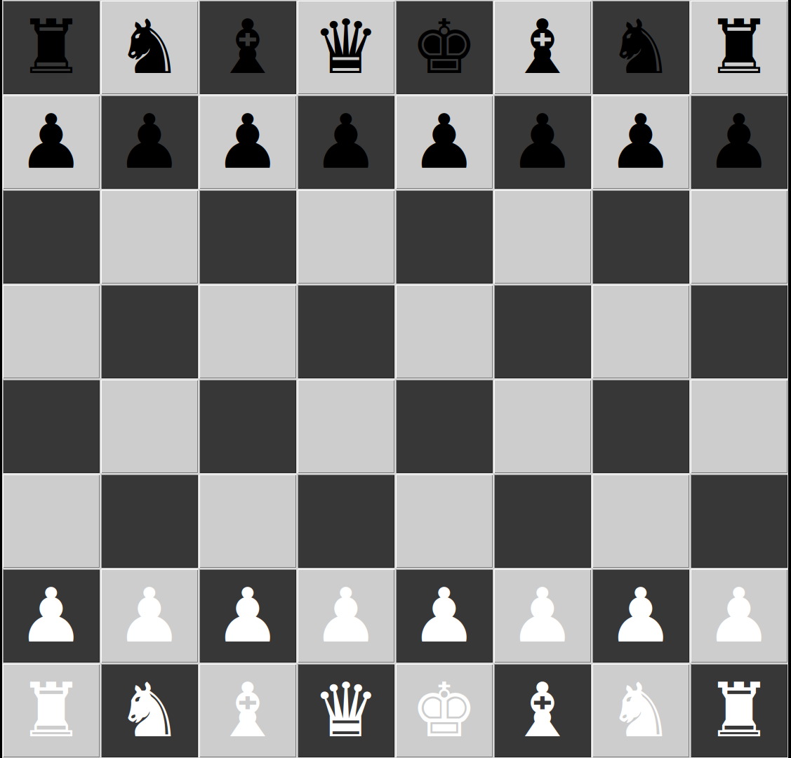
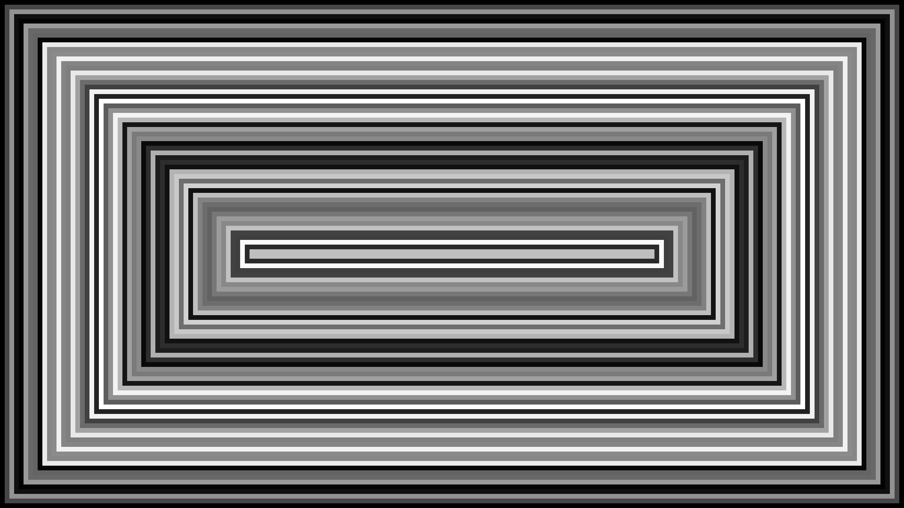
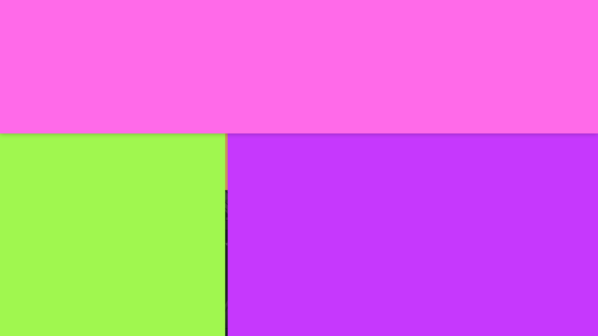
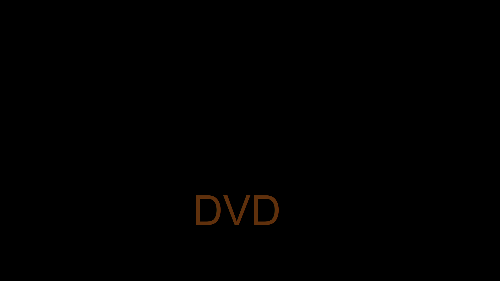
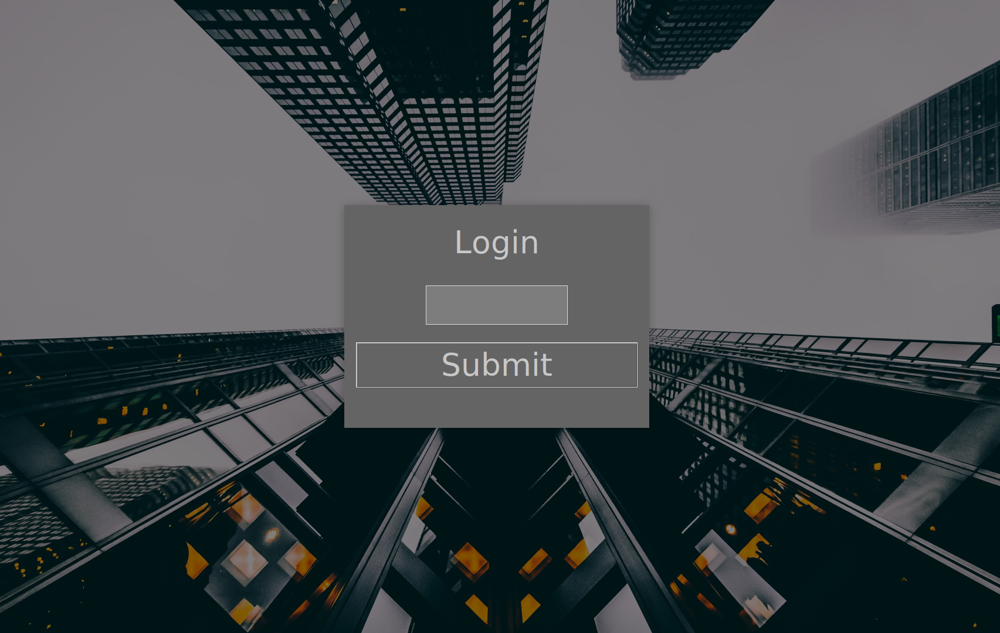

# Python

 * Windows

   * Bank simulator
   * 

 * Linux
   * Chess board (GUI)
   
     
   * Cycle-art (GUI)
   
   * Divided-window (GUI)
   
   * DVD simulator (GUI)
   
   * Login (GUI)
   